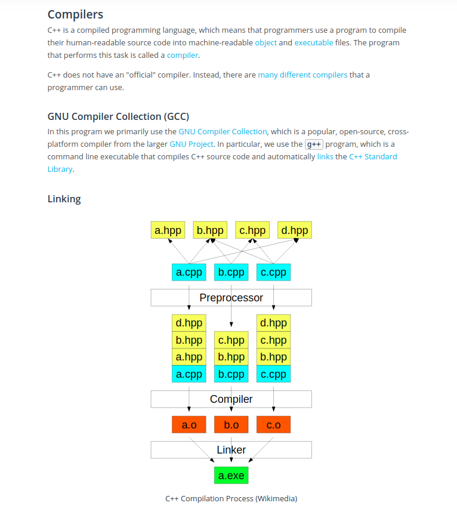
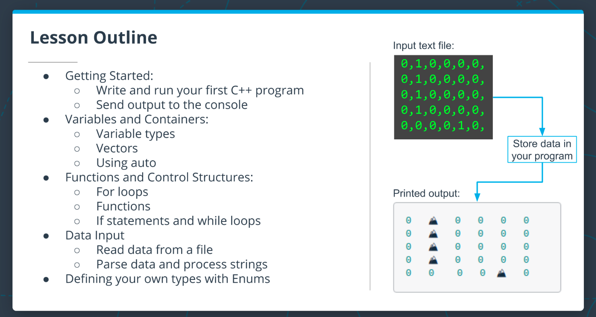
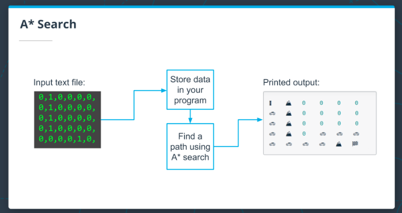

## clang-format Extension

## C++ extension

## DEbuggingMode

add BreakPoints
compile file using g++ -g filename.cpp
and press F5
Wlcome to Debugging mode.

## Bjarne Stroustrup - the creator of C++




C++ is a compiled language; there is a separate program - the compiler - that converts your code to an executable program that the computer can run. This means that running a new C++ program is normally a two step process:

Compile your code with a compiler.
Run the executable file that the compiler outputs.

## Review

`#include <iostream>`

- The `#include` is a preprocessor command which is executed before the code is compiled. It searches for the `iostream` header file and pastes its contents into the program. `iostream` contains the declarations for the input/output stream objects.

`using std::cout;`

- Namespaces are a way in C++ to group identifiers (names) together. They provide context for identifiers to avoid naming collisions. The `std` namespace is the namespace used for the standard library.
- The `using` command adds `std::cout` to the global scope of the program. This way you can use `cout` in your code instead of having to write `std::cout`.
- `cout` is an output stream you will use to send output to the notebook or to a terminal, if you are using one.
- Note that the second two lines in the example end with a semicolon `;`. Coding statements end with a semicolon in C++. The `#include` statement is a preprocessor command, so it doesn't need one.

`cout << "Hello!" << "\n";`

- In this line, the code is using cout to send output to the notebook. The `<<` operator is the stream insertion operator, and it writes what's on the right side of the operator to the left side. So in this case, `"Message here"` is written to the output stream `cout`.

## Vector Containers

### 1D Vectors and 2D Vector

C++ also has several container types that can be used for storing data. We will start with `vector`s, as these will be used throughout this lesson, but we will also introduce other container types as needed.

Vectors are a sequence of elements of a single type, and have useful methods for getting the size, testing if the vector is empty, and adding elements to the vector.

```c++
#include <iostream>
#include <vector>
using std::vector;
using std::cout;

int main() {
    // Three ways of declaring and initializing vectors.
    vector<int> v_1{0, 1, 2};
    vector<int> v_2 = {3, 4, 5};
    vector<int> v_3;
    v_3 = {6};
    cout << "Everything worked!" << "\n";
}


    // Creating a 2D vector.
    vector<vector<int>> v {{1,2}, {3,4}};
```

## auto

It is possible for C++ to do automatic type inference, using the auto keyword.

## ..

If you tried to access the elements of a using an out-of-bound index, you might have noticed that there is no error or exception thrown. If you haven't seen this already, try the following code in the cell above to see what happens:

cout << a[10];

In this case, the behavior is undefined, so you can not depend on a certain value to be returned. Be careful about this!

## For Loop with a Container

C++ offers several ways to iterate over containers. One way is to use an index-based loop as u know. Another way is using a "range-based loop", which you will see frequently in the rest of this course. See the following code for an example of how this works:

```c++
#include <iostream>
#include <vector>
using std::cout;
using std::vector;
​
int main() {
    // Add your code here.
    vector<int> a {1, 2, 3, 4, 5};
    for (int i: a) {
        cout << i << "\n";
    }
}

```

## Vectors Method

```c++
begin()
end()
size()
at()
push_back()
```

## Enums

An enum, short for enumerator, is a way to define a type in C++ with values that are restricted to a fixed range.

```c++
// Create the enum Color with fixed values.
enum class Color { white, black, blue, red};


// Create a Color variable and set it to Color::blue.
Color my_color = Color::blue;
```

Note: In the example above, the keyword enum is followed by the keyword class and then the class name Color. This creates what are called "scoped" enums. It is also possible, but not advisable, to omit the class keyword and thus create "unscoped" enums

```c++
#include <iostream>
using std::cout;

int main()
{
    enum class Direction {kUp, kDown, kLeft, kRight};

    Direction a = Direction::kUp;

    switch (a) {
      case Direction::kUp : cout << "Going up!" << "\n";
        break;
      case Direction::kDown : cout << "Going down!" << "\n";
        break;
      case Direction::kLeft : cout << "Going left!" << "\n";
        break;
      case Direction::kRight : cout << "Going right!" << "\n";
        break;
    }
}
```

## A\* ALGO


