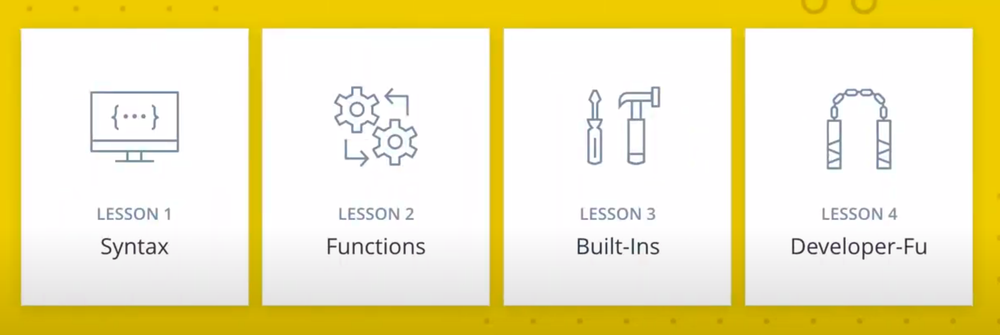
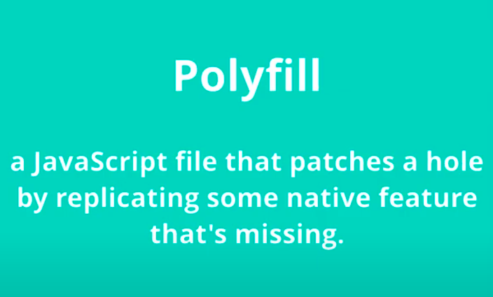

### Syntax

- Let vs const
- String literals.interploation
  In ES6, you can extract data from arrays and objects into distinct variables using destructuring.
  bject literal shorthand

You’ve probably written code where an object is being initialized using the same property names as the variable names being assigned to them.

But just in case you haven’t, here’s an example.

```js
let type = "quartz";
let color = "rose";
let carat = 21.29;

const gemstone = {
  type: type,
  color: color,
  carat: carat,
};

console.log(gemstone);
```

Prints: Object {type: "quartz", color: "rose", carat: 21.29}

Do you see the repetition? Doesn't type: type, color: color, and carat:carat seem redundant?

The good news is that you can remove those duplicate variables names from object properties _if_ the properties have the same name as the variables being assigned to them.

- for-of-loop
- spread Operator - get values out of array
- rest Operator, fill array with values, earlier argument was a keyword in functions which is an array of all the passed arguments.
  Earlier:

```js
function sum() {
  let total = 0;
  for (const argument of arguments) {
    total += argument;
  }
  return total;
}
```

Now:

````js
function sum(...nums) {
  let total = 0;
  for(const num of nums) {
    total += num;
  }
  return total;
}```
````

## this


## Default Params

- with array destructring
- with object destructring

## Classes

- Javascript is not a class-based language
- Javascript implements classes using regular functions only and creates an object using `new` keyword.
- Javascript links objects together with prototypal inheritance.
- ES6 classes hide the fact that prototypal inheritance is actually going on under the hood, let's quickly look at how to create a "class" with ES5 code:

```js
function Plane(numEngines) {
  this.numEngines = numEngines;
  this.enginesActive = false;
}

// methods "inherited" by all instances
Plane.prototype.startEngines = function () {
  console.log("starting engines...");
  this.enginesActive = true;
};

var richardsPlane = new Plane(1);
richardsPlane.startEngines();

var jamesPlane = new Plane(4);
jamesPlane.startEngines();
```

###### Things to note:

- the constructor function is called with the new keyword
- the constructor function, by convention, starts with a capital letter
- the constructor function controls the setting of data on the objects that will be created
- "inherited" methods are placed on the constructor function's prototype object

- ES6 Classes
  Here's what that same Plane class would look like if it were written using the new class syntax:

```js
class Plane {
  constructor(numEngines) {
    this.numEngines = numEngines;
    this.enginesActive = false;
  }

  startEngines() {
    console.log("starting engines…");
    this.enginesActive = true;
  }
}
```

### Proof

```js
typeof Plane; // function
```

## Static methods

To add a static method, the keyword static is placed in front of the method name. Look at the badWeather() method in the code below.

```js
class Plane {
  constructor(numEngines) {
    this.numEngines = numEngines;
    this.enginesActive = false;
  }

  static badWeather(planes) {
    for (plane of planes) {
      plane.enginesActive = false;
    }
  }

  startEngines() {
    console.log("starting engines…");
    this.enginesActive = true;
  }
}
// See how badWeather() has the word static in front of it while startEngines() doesn't? That makes badWeather() a method that's accessed directly on the Plane class, so you can call it like this:

Plane.badWeather([plane1, plane2, plane3]);
```

## Benefits of classes

- Less setup
- There's a lot less code that you need to write to create a function
- Clearly defined constructor function
- Inside the class definition, you can clearly specify the constructor function.
- Everything's contained, All code that's needed for the class is contained in the class declaration. Instead of having the constructor function in one place, then adding methods to the prototype one-by-one, you can do everything all at once!

## Subclasses with ES6

Now that we've looked at creating classes in JavaScript. Let's use the new super and extends keywords to extend a class.

```js
class Tree {
  constructor(
    size = "10",
    leaves = { spring: "green", summer: "green", fall: "orange", winter: null }
  ) {
    this.size = size;
    this.leaves = leaves;
    this.leafColor = null;
  }

  changeSeason(season) {
    this.leafColor = this.leaves[season];
    if (season === "spring") {
      this.size += 1;
    }
  }
}

class Maple extends Tree {
  constructor(syrupQty = 15, size, leaves) {
    super(size, leaves);
    this.syrupQty = syrupQty;
  }

  changeSeason(season) {
    super.changeSeason(season);
    if (season === "spring") {
      this.syrupQty += 1;
    }
  }

  gatherSyrup() {
    this.syrupQty -= 3;
  }
}

const myMaple = new Maple(15, 5);
myMaple.changeSeason("fall");
myMaple.gatherSyrup();
myMaple.changeSeason("spring");
```

Both Tree and Maple are JavaScript classes. The Maple class is a "subclass" of Tree and uses the extends keyword to set itself as a "subclass". To get from the "subclass" to the parent class, the super keyword is used. Did you notice that super was used in two different ways? In Maple's constructor method, super is used as a function. In Maple's changeSeason() method, super is used as an object!

**Compared to ES5 subclasses**
Let's see this same functionality, but written in ES5 code:

```js
function Tree(size, leaves) {
  this.size = (typeof size === "undefined")? 10 : size;
  const defaultLeaves = {spring: 'green', summer: 'green', fall: 'orange', winter: null};
  this.leaves = (typeof leaves === "undefined")?  defaultLeaves : leaves;
  this.leafColor;
}

Tree.prototype.changeSeason = function(season) {
  this.leafColor = this.leaves[season];
  if (season === 'spring') {
    this.size += 1;
  }
}

function Maple (syrupQty, size, leaves) {
  Tree.call(this, size, leaves);
  this.syrupQty = (typeof syrupQty === "undefined")? 15 : syrupQty;
}

Maple.prototype = Object.create(Tree.prototype);
Maple.prototype.constructor = Maple;

Maple.prototype.changeSeason = function(season) {
  Tree.prototype.changeSeason.call(this, season);
  if (season === 'spring') {
    this.syrupQty += 1;
  }
}

Maple.prototype.gatherSyrup = function() {
  this.syrupQty -= 3;
}

const myMaple = new Maple(15, 5);
myMaple.changeSeason('fall');
myMaple.gatherSyrup();
myMaple.changeSeason('spring');
Both this code and the class-style code above achieve the same functionality.

```

## Built-ins

- Symbols `Symbols("something")`
- Interable and Interator `array[Symbol.iterator]()` and `arrayIterator.next()`
- Sets `new Set(array)`
- Maps `new Map(object)`
- Promises `new Promise((resolve, reject) => {})`
- Generator

## Symbols


### Iterables

- In order for an object to be iterable it must contain a `default iterator method`. This method will define how the object should be iterate
- **The iterator method**, which is available via the constant `[Symbol.iterator]`, is a zero arguments function that returns an iterator object.

- An object becomes an iterator when it implements the .next() method. The .next() method is a zero arguments function that returns an object with two properties:

`value` : the data representing the next value in the sequence of values within the object
`done` : a boolean representing if the iterator is done going through the sequence of values

- If done is true, then the iterator has reached the end of its sequence of values.
- If done is false, then the iterator is able to produce another value in its sequence of values.
  Here’s the example from earlier, but instead we are using the array’s default iterator to step through the each value in the array.

```js
const digits = [0, 1, 2, 3, 4, 5, 6, 7, 8, 9];
// the iterator method, which is available via the constant [Symbol.iterator], is a zero arguments function that returns an iterator object.
const arrayIterator = digits[Symbol.iterator]();


console.log(arrayIterator.next());
console.log(arrayIterator.next());
console.log(arrayIterator.next());

// output
Object {value: 0, done: false}
Object {value: 1, done: false}
Object {value: 2, done: false}
```

## Sets

- In ES6, there’s a new built-in object that behaves like a mathematical set and works similarly to an array. This new object is conveniently called a "Set". The biggest differences between a set and an array are:

- Sets are not indexed-based - you do not refer to items in a set based on their position in the set
  items in a Set can’t be accessed individually
- Basically, a Set is an object that lets you store unique items. You can add items to a Set, remove items from a Set, and loop over a Set. These items can be either primitive values or objects.

**How to Create a Set**
There’s a couple of different ways to create a Set. The first way, is pretty straightforward:

```js
const games = new Set();
console.log(games);
// output
Set {}
```

This creates an empty Set games with no items.

If you want to create a Set from a list of values, you use an array:

```js
const games = new Set(['Super Mario Bros.', 'Banjo-Kazooie', 'Mario Kart', 'Super Mario Bros.']);
console.log(games);
// output
Set {'Super Mario Bros.', 'Banjo-Kazooie', 'Mario Kart'}
```

##### Add/Delete

```js
const games = new Set([
  "Super Mario Bros.",
  "Banjo-Kazooie",
  "Mario Kart",
  "Super Mario Bros.",
]);

games.add("Banjo-Tooie");
games.add("Age of Empires");
games.delete("Super Mario Bros.");
```

> > TIP: If you attempt to .add() a duplicate item to a Set, you won’t receive an error, but the item will not be added to the Set. Also, if you try to .delete() an item that is not in a Set, you won’t receive an error, and the Set will remain unchanged.

> > .add() returns the Set if an item is successfully added. On the other hand, .delete() returns a Boolean (true or false) depending on successful deletion.

- Use the .size property to return the number of items in a Set:
- Use the .has() method to check if an item exists in a Set.

**Retrieving All Values**
Finally, use the .values() method to return the values in a Set. The return value of the .values() method is a SetIterator object.

```js
console.log(months.values());
SetIterator {'January', 'February', 'March', 'April', 'May', 'June', 'July', 'August', 'September', 'October', 'November', 'December'}
```

> > TIP: The .keys() method will behave the exact same way as the .values() method by returning the values of a Set within a new Iterator Object. The .keys() method is an alias for the .values() method for similarity with maps. You’ll see the .keys() method later in this lesson during the Maps section.

##### Using a for...of Loop

An easier method to loop through the items in a Set is the for...of loop.

```js
const colors = new Set([
  "red",
  "orange",
  "yellow",
  "green",
  "blue",
  "violet",
  "brown",
  "black",
]);
for (const color of colors) {
  console.log(color);
}
```

## Maps


```js
const employees = new Map();
console.log(employees);
```

###### Modifying Maps

Unlike Sets, you can’t create Maps from a list of values; instead, you add key-values by using the Map’s .set() method.

```js
const employees = new Map();

employees.set('james.parkes@udacity.com', {
    firstName: 'James',
    lastName: 'Parkes',
    role: 'Content Developer'
});
employees.set('julia@udacity.com', {
    firstName: 'Julia',
    lastName: 'Van Cleve',
    role: 'Content Developer'
});
employees.set('richard@udacity.com', {
    firstName: 'Richard',
    lastName: 'Kalehoff',
    role: 'Content Developer'
});

console.log(employees);
Map {'james.parkes@udacity.com' => Object {...}, 'julia@udacity.com' => Object {...}, 'richard@udacity.com' => Object {...}}
```

The .set() method takes two arguments. The first argument is the key, which is used to reference the second argument, the value.

To remove key-value pairs, simply use the .delete() method.

```js
employees.delete('julia@udacity.com');
employees.delete('richard@udacity.com');
console.log(employees);
Map {'james.parkes@udacity.com' => Object {firstName: 'James', lastName: 'Parkes', role: 'Course Developer'}}
```

Again, similar to Sets, you can use the .clear() method to remove all key-value pairs from the Map.

```js
employees.clear()
console.log(employees);
Map {}
```

> > TIP: If you .set() a key-value pair to a Map that already uses the same key, you won’t receive an error, but the key-value pair will overwrite what currently exists in the Map. Also, if you try to .delete() a key-value that is not in a Map, you won’t receive an error, and the Map will remain unchanged.

> > The .delete() method returns true if a key-value pair is successfully deleted from the Map object, and false if unsuccessful. The return value of .set() is the Map object itself if successful.

## Promises

A Promise constructor takes a function that will run and then, after some amount of time, will either complete successfully (using the resolve method) or unsuccessfully (using the reject method). When the outcome has been finalized (the request has either completed successfully or unsuccessfully), the promise is now fulfilled and will notify us so we can decide what to do with the response.

##### Promises Return Immediately

The first thing to understand is that a Promise will immediately return an object.

```js
const myPromiseObj = new Promise((resolve, reject) => {
  // sundae creation code
});
```

That object has a .then() method on it that we can use to have it notify us if the request we made in the promise was either successful or failed. The .then() method takes two functions:

- the function to run if the request completed successfully
- the function to run if the request failed to complete

```js
mySundae.then(
  (sundae) => {
    console.log(`Time to eat my delicious ${sundae}`);
  },
  (msg) => {
    console.log(msg);
    self.goCry(); // not a real method
  }
);
```

As you can see, the first function that's passed to .then() will be called and passed the data that the Promise's resolve function used. In this case, the function would receive the sundae object. The second function will be called and passed the data that the Promise's reject function was called with. In this case, the function receives the error message "Sorry, we're out of that flavor :-(" that the reject function was called with in the Promise code above.

## Generator

- Whenever a function is invoked, the JavaScript engine starts at the top of the function and runs every line of code until it gets to the bottom. There's no way to stop the execution of the function in the middle and pick up again at some later point. This "run-to-completion" is the way it's always been:

- But what if you want to print out the first 3 employee names then stop for a bit, then, at some later point, you want to continue where you left off and print out more employee names. With a regular function, you can't do this since there's no way to "pause" a function in the middle of its execution.

#### Pausable Functions

If we _do_ want to be able to pause a function mid-execution, then we'll need a new type of function available to us in ES6 - **generator functions**! Let's look at one:

```js
function* getEmployee() {
  console.log("the function has started");

  const names = [
    "Amanda",
    "Diego",
    "Farrin",
    "James",
    "Kagure",
    "Kavita",
    "Orit",
    "Richard",
  ];

  for (const name of names) {
    console.log(name);
  }

  console.log("the function has ended");
}
```

- Notice the asterisk (i.e. \*) right after the function keyword? That asterisk indicates that this function is actually a generator!

- Now check out what happens when we try running this function:

```js
getEmployee();
// this is the response I get in Chrome:
getEmployee {[[GeneratorStatus]]: "suspended", [[GeneratorReceiver]]: Window}
```

**The asterisk of the generator can actually be placed anywhere between the function keyword and the function's name.**
When a generator is invoked, it doesn't actually run any of the code inside the function. Instead, it creates and returns an iterator. This iterator can then be used to execute the actual generator's inner code.

```js
const generatorIterator = getEmployee();
generatorIterator.next();
```

**Produces the code we expect:**

```js
the function has started
Amanda
Diego
Farrin
James
Kagure
Kavita
Orit
Richard
the function has ended
```

Now if you tried the code out for yourself, the first time the iterator's `.next()` method was called it ran all of the code inside the generator. Did you notice anything? The code never paused! So how do we get this magical, pausing functionality?

##### yield Keyword

- It can only be used inside generator functions. yield is what causes the generator to pause.

```js
function* getEmployee() {
  console.log("the function has started");

  const names = [
    "Amanda",
    "Diego",
    "Farrin",
    "James",
    "Kagure",
    "Kavita",
    "Orit",
    "Richard",
  ];

  for (const name of names) {
    console.log(name);
    yield;
  }

  console.log("the function has ended");
}
```

- yield is used as a return but it saves where did it left off earlier.

```js
function* getEmployee() {
  console.log("the function has started");

  const names = [
    "Amanda",
    "Diego",
    "Farrin",
    "James",
    "Kagure",
    "Kavita",
    "Orit",
    "Richard",
  ];

  for (const name of names) {
    yield name;
  }

  console.log("the function has ended");
}
```

Notice that now instead of console.log(name); that it's been switched to yield name;. With this change, when the generator is run, it will "yield" the name back out to the function and then pause its execution. Let's see this in action:

```js
const generatorIterator = getEmployee();
let result = generatorIterator.next();
result.value; // is "Amanda"

generatorIterator.next().value; // is "Diego"
generatorIterator.next().value; // is "Farrin"
```

We can also send data back into the generator, too. We do this using the .next() method:

```js
function* displayResponse() {
  const response = yield;
  console.log(`Your response is "${response}"!`);
}

const iterator = displayResponse();

iterator.next(); // starts running the generator function
iterator.next("Hello Udacity Student"); // send data into the generator
// the line above logs to the console: Your response is "Hello Udacity Student"!
```

Calling .next() with data (i.e. .next('Richard')) will send data into the generator function where it last left off. It will "replace" the yield keyword with the data that you provided.

## Professional Developer-fu

The code we've been looking at in this course is not supported by older browsers. Older browsers that were developed prior to the release of ES6 were developed to support the version of JavaScript at the time (which was ES5.1). If you try running any ES6 code in an older browser, it won't work.

##### How Can You Know What Features Browsers Support?

With new language specifications coming out every year and with browsers updating every other month, it can be quite challenging to know what browser supports which language features. Each browser maker (except for Safari) has a website that tracks its development status.



- A polyfill, or polyfiller, is a piece of code (or plugin) that provides the technology that you, the developer, expect the browser to provide natively.

The code below is a polyfill for the new ES6 String method, startsWith():

```js
if (!String.prototype.startsWith) {
  String.prototype.startsWith = function (searchString, position) {
    position = position || 0;
    return this.substr(position, searchString.length) === searchString;
  };
}
As you can see, a polyfill is just regular JavaScript.

```

a polyfill is used to patch missing functionality. If the browser supports ES6 and has the native startsWith method, then there's no reason to polyfill it. If this check didn't exist, then this polyfill would overwrite the native implementation.

- Use Babel to transpile ES6 code to ES5 , using babel-cli and babel-es5-presets
