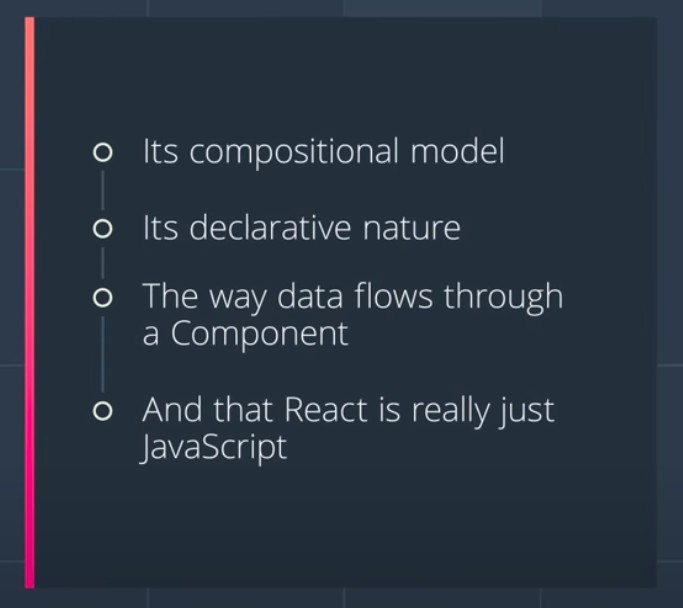
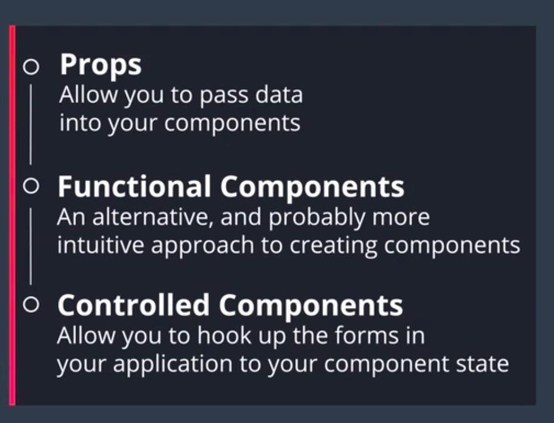
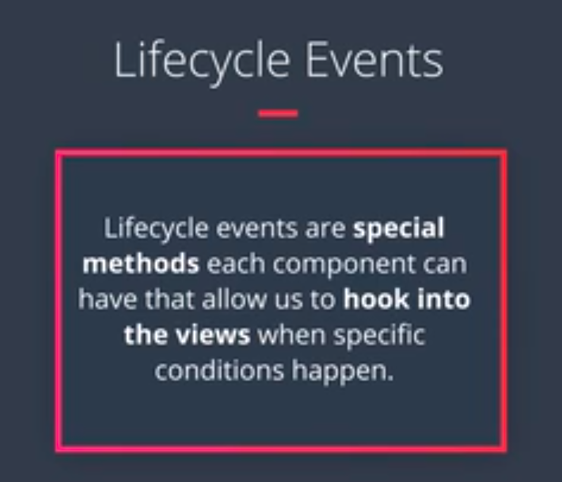

### Composition is:

- to combine simple functions to build more complicated ones.
- Composition is built from simple functions.
- Composition occurs when simple functions are combined together to create more complex functions. Think of each function as a single building block that does one thing (DOT). When you combine these simple functions together to form a more complex function, this is composition.



#### React & Composition

React makes use of the power of composition, heavily! React builds up pieces of a UI using components. Let's take a look at some pseudo code for an example. Here are three different components:

```
<Page>
 <Article />
 <Sidebar />
</Page>
```

- When JavaScript code is written imperatively, we tell JavaScript exactly what to do and how to do it.
- React is Declarative
  -Imperative code instructs JavaScript on how it should perform each step. With declarative code, we tell JavaScript what we want to be done, and let JavaScript take care of performing the steps.

- Components represent the modularity and reusability of React.
- These component classes should follow the single responsibility principle and just "do one thing"

### Scaffolding Your React App

- JSX is awesome, but it does need to be transpiled into regular JavaScript before reaching the browser. We typically use a transpiler like Babel to accomplish this for us. We can run Babel through a build tool, like Webpack which helps bundle all of our assets (JavaScript files, CSS, images, etc.) for web projects.

- To streamline these initial configurations, we can use Facebook's Create React App package to manage all the setup for us! This tool is incredibly helpful to get started in building a React app, as it sets up everything we need with zero configuration! Install Create React App (through the command-line with npm), and then we can walk through what makes it so great.

- Yarn is a package manager that's similar to NPM. Yarn was created from the ground up by Facebook to improve on some key aspects that are slow or lacking in NPM.

#### create-react-app Recap

- Facebook's create-react-app is a command-line tool that scaffolds a React application. Using this, there is no need to install or configure module bundlers like Webpack, or transpilers like Babel. These come preconfigured (and hidden) with create-react-app, so you can jump right into building your app!

- React encourages us to build applications using composition instead of inheritance.
- Yes, we extend React.Component, but we never extend it more than once. Instead of extending base components to add more UI or behavior, we compose elements in different ways using nesting and props. You ultimately want your UI components to be independent, focused, and reusable.

```
So if you’ve never understood what it means to “favor composition over inheritance” you’ll definitely learn using React!
```

- In a blog post, written by Facebook they had mentioned that they had never used Inheritance in their React code across thousands of components. This shows how just using Composition can solve code reuse problems in React

#### Stateless Functional Components Recap

If your component does not keep track of internal state (i.e., all it really has is just a render() method), you can declare the component as a Stateless Functional Component.

- props represent "read-only" data that are immutable.
- A component's state, on the other hand, represents mutable data that ultimately affects what is rendered on the page. State is managed internally by the component itself and is meant to change over time, commonly due to user input (e.g., clicking on a button on the page).
- Having state outside the constructor() means it is a class field, which is a proposal for a new change to the language. It currently isn't supported by JavaScript, but thanks to Babel's fantastic powers of transpiling, we can use it!
- When defining a component's initial state, avoid initializing that state with props. This is an error-prone anti-pattern, since state will only be initialized with props when the component is first created.

```
this.state = {
user: props.user
}
```

- In the above example, if props are ever updated, the current state will not change unless the component is "refreshed." Using props to produce a component's initial state also leads to duplication of data, deviating from a dependable "source of truth."
- This process of determining what has changed in the previous and new outputs is called Reconciliation.
- How State is Set
  ```
  Earlier in this lesson, we saw how we can define a component's state at the time of initialization. Since state reflects mutable information that ultimately affects rendered output, a component may also update its state throughout its lifecycle using this.setState(). As we've learned, when local state changes, React will trigger a re-render of the component.
  ```

#### There are two ways to use setState().

- The first is to merge state updates. Consider a snippet of the following component:

```
class Email extends React.Component {
state = {
subject: '',
message: ''
}
// ...
});
```

Though the initial state of this component contains two properties (subject and message), they can be updated independently. For example:

```
this.setState({
subject: 'Hello! This is a new subject'
})
```

- This way, we can leave this.state.message as-is, but replace this.state.subject with a new value.
- The second way we can use setState() is by passing in a function rather than an object. For example:

```
this.setState((prevState) => ({
count: prevState.count + 1
}))
```

- Here, the function passed in takes a single prevState argument. When a component's new state depends on the previous state (i.e., we are incrementing count in the previous state by 1), we want to use the functional setState().

#### setState() Recap

While a component can set its state when it initializes, we expect that state to change over time, usually due to user input. The component is able to change its own internal state using this.setState(). Each time state is changed, React knows and will call render() to re-render the component. This allows for fast, efficient updates to your app's UI.

## Your UI is just a function of your state

for all components, its UI = f(state).

- Functions that are updating the state(let x) in some way must reside in state-x component, not in children or parent.
- Type checking a Component's Props with PropTypes
  As we implement additional features into our app, we may soon find ourselves debugging our components more frequently. For example, what if the props that we pass to our components end up being an unintended data type (e.g. an object instead of an array)? PropTypes is a package that lets us define the data type we want to see right from the get-go and warn us during development if the prop that's passed to the component doesn't match what is expected.
  To use PropTypes in our app, we need to install prop-types:

```
npm install --save prop-types
```

Alternatively, if you have been using yarn to manage packages, feel free to use it as well to install:

```
yarn add prop-types
```

### Controlled Components Recap

- Controlled components refer to components that render a form, but the "source of truth" for that form state lives inside of the component state rather than inside of the DOM.

##### The benefits of Controlled Components are:

- instant input validation
- conditionally disable/enable buttons
- enforce input formats



- In our ListContacts component, not only does the component render a form, but it also controls what happens in that form based on user input. In this case, event handlers update the component's state with the user's search query. And as we've learned: any changes to React state will cause a re-render on the page, effectively displaying our live search results.
- **Putting it All Into Perspective**
  When it comes to keeping track of data in your app, think about what will be done with that data, and what that data will look like as your user interfaces with your app. If you want your component to store mutable local data, consider using state to hold this information. Many times, it is state that will be used to manage controlled form elements in your components.
- On the other hand, if some information isn't expected to change over time, and is generally designed to be "read-only" throughout your app, consider using props instead. Both state and props will generally be in the form of an object, and changes in either will trigger a re-render of the component, but they each play very different roles in your app.
- We covered a lot in this lesson, and you've made great progress - great work!
- render() is only used for displaying content, we put the code that should handle things like Ajax requests in what React calls lifecycle events.



### Lifecycle Events

Lifecycle events are specially named methods in a component. These methods are automatically bound to the component instance, and React will call these methods naturally at certain times during the life of a component. There are a number of different lifecycle events, but here are the most commonly used ones.

> > componentDidMount()
> > invoked immediately after the component is inserted into the DOM

> > componentWillUnmount()
> > invoked immediately before a component is removed from the DOM

> > getDerivedStateFromProps()
> > invoked after a component is instantiated as well as when it receives brand new props

- To use one of these, you'd just create a method in your component with the name and React will call it. It's an easy way to hook into different parts of the lifecycle of React components.

- The lifecycle event that we'll be looking at (and will be using a lot in our app!) is the componentDidMount() lifecycle event.

- You'll sometimes see shouldComponentUpdate() in React apps as well. It returns true by default. This means that whenever a component's state (or its parent's state) is updated, the component re-renders.

- The React documentation provides the following guidance for using this lifecycle event:

- The default behavior is to re-render on every state change, and in the vast majority of cases you should rely on the default behavior.
- Do not rely on it to “prevent” a rendering, as this can lead to bugs.
- Consider using the built-in PureComponent instead of writing shouldComponentUpdate() by hand.
  We do not recommend doing deep equality checks or using JSON.stringify() in shouldComponentUpdate(). It is very inefficient and will harm performance.

## Now, there are a number of different lifecycle events.

They will run at different points, but we can break them down into three distinct categories:

### Adding to the DOM

The following lifecycle events will be called in order when a component is being added to the DOM:

```
constructor()
getDerivedStateFromProps()
render()
componentDidMount()
```

⚠️componentWillMount() has been deprecated. ⚠️
As of React 16.3, componentWillMount() has been replaced with UNSAFE_componentWillMount(). Only UNSAFE_componentWillMount() will work starting with React 17.0. UNSAFE_componentWillMount() is now considered to be a legacy method and should not be used in new code.

### Re-rendering

The following lifecycle events will be called in order when a component is re-rendered to the DOM:

```
getDerivedStateFromProps()
shouldComponentUpdate()
render()
getSnapshotBeforeUpdate()(specific use cases)
componentDidUpdate()
```

⚠️componentWillReceiveProps() and componentWillUpdate() have been deprecated. ⚠️

As of React 16.3, they have been replaced with UNSAFE_componentWillUpdate() and UNSAFE_componentWillReceiveProps(). Only UNSAFE_componentWillUpdate() and UNSAFE_componentWillReceiveProps() will work starting with React 17.0. UNSAFE_componentWillUpdate() and UNSAFE_componentWillReceiveProps() are now considered to be legacy methods and should not be used in new code.

### Removing from the DOM

This lifecycle event is called when a component is being removed from the DOM:

```
componentWillUnmount()
```
