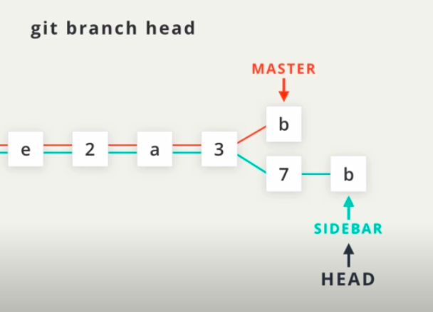
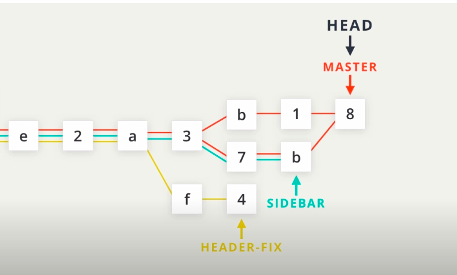
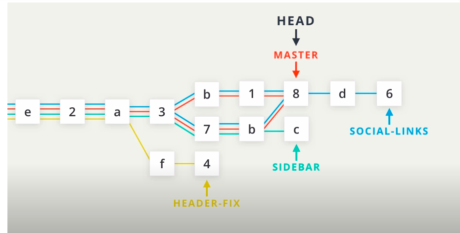
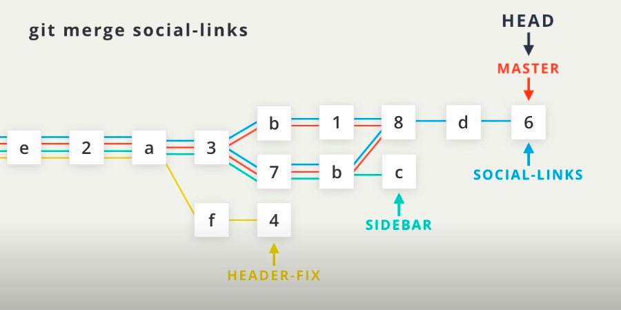

## Git

- `git init`
- `git clone`
- `git status`
- `git log`
- `git show`
- `git log --oneline` (shows only the SHA and Commit message)
- `git log --stat` (shows the files changes & how many deletion/insertion per file)
- `git log --oneline --stat`
- `git log --patch` (shows exactly what changed in which file)
- `git log --patch --stat`
- `git diff` (The git diff command can be used to see changes that have been made but haven't been committed, yet.)

- `git tag -a <tagname>` (Adding a name to some commit, default to last commit , otherwise pass SHA value after tagname).
- `git branch <branchname>`
- `git branch -d sidebar` (delete a branch)
- `git checkout <branchname>`
- `git checkout -b <branchname>` (git checkout command can actually create a new branch, too? If you provide the -b flag, you can create a branch and switch to it all in one command.)
- `git merge <other-branch>`(merges other-branch to the branch head is pointing to)
- `git log --oneline --graph --all`

### INFO

- The act of moving a file from the Working Directory to the Staging Index is called "staging". If a file has been moved, then it has been "staged". Moving a file from the Staging Index back to the Working Directory will unstage the file. If you read documentation that says "stage the following files" that means you should use the git add command.

- The goal is that each commit has a single focus. Each commit should record a single-unit change. Now this can be a bit subjective (which is totally fine), but each commit should make a change to just one aspect of the project.

  - Now this isn't limiting the number of lines of code that are added/removed or the number of files that are added/removed/modified. Let's say you want to change your sidebar to add a new image. You'll probably:

  - add a new image to the project files
    alter the HTML
    add/modify CSS to incorporate the new image
    A commit that records all of these changes would be totally fine!

  - Conversely, a commit shouldn't include unrelated changes - changes to the sidebar and rewording content in the footer. These two aren't related to each other and shouldn't be included in the same commit. Work on one change first, commit that, and then change the second one. That way, if it turns out that one change had a bug and you have to undo it, you don't have to undo the other change too.

  - The best way that I've found to think about what should be in a commit is to think, "What if all changes introduced in this commit were erased?". If a commit were erased, it should only remove one thing.

## Commands

```
$ git config --global core.editor "code --wait"
```

## Globbing Crash Course

Let's say that you add 50 images to your project, but want Git to ignore all of them. Does this mean you have to list each and every filename in the .gitignore file? Oh gosh no, that would be crazy! Instead, you can use a concept called globbing.

Globbing lets you use special characters to match patterns/characters. In the .gitignore file, you can use the following:

blank lines can be used for spacing
`#` - marks line as a comment
`*` - matches 0 or more characters
`?` - matches 1 character
`[abc]` - matches a, b, _or_ c
`**` - matches nested directories - a/\*\*/z matches

- a/z
- a/b/z
- a/b/c/z

## Tagging

- Git Tag Command
  The command we'll be using to interact with the repository's tags is the git tag command:

```
$ git tag -a v1.0
```

- This flag tells Git to create an annotated flag. If you don't provide the flag (i.e. git tag v1.0) then it'll create what's called a lightweight tag.

> > Annotated tags are recommended because they include a lot of extra information such as:

- the person who made the tag
- the date the tag was made
- a message for the tag
- Because of this, you should always use annotated tags.

## Deleting A Tag

- What if you accidentally misspelled something in the tag's message, or mistyped the actual tag name (v0.1 instead of v1.0). How could you fix this? The easiest way is just to delete the tag and make a new one.

- A Git tag can be deleted with the -d flag (for delete!) and the name of the tag:

```
$ git tag -d v1.0
```

## Brancing and HeadPointer, Masterpointer



## Merging

the git merge command is used to combine branches in Git:

```
$ git merge <other-branch>
```

#### There are two types of merges:

- the regular type of merge
  - two divergent branches are combined
  - a merge commit is created



- Fast-forward merge – the branch being merged in must be ahead of the checked out branch. The checked out branch's pointer will just be moved forward to point to the same commit as the other branch.
  
  
