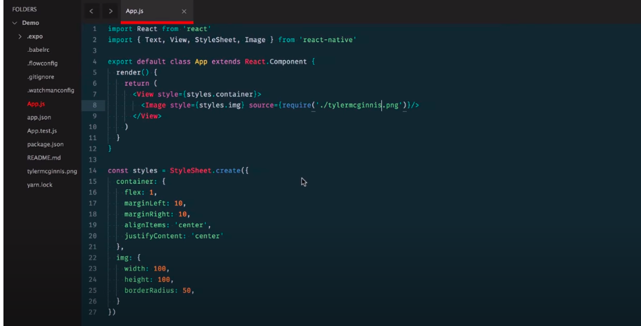
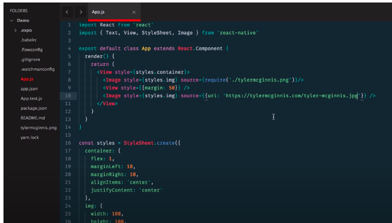

# React Native

React native allows you to use react to build native ios and android application. Sounds too good to be true, well it isn't.

- It is more beneficial for startups
- How ? Instead of a web team, ios tema, android team, with reactive native u can just have a single UI team, this saves money and developers hours as well.

- React Native follows "Learn ones, write anywhere".
- Not write once run anywhere.
- It means react and redux principles are used to create react native applications things like component composition and declarative UI.
- **Instead of sharing the same codebase , react native shares the same priniciples of react to build apps for web ,android, and ios.**

## React Native Under the Hood

When React was first introduced, a big selling point was the Virtual DOM. The idea is pretty standard in most UI libraries now, but when it first came out, it was groundbreaking! We can look at what exactly the Virtual DOM is by breaking down the process of what happens when you call setState().

The first thing React does when setState() is called is merge the object passed to setState() into the current state of the component. This will kick off a process called reconciliation. The end goal of reconciliation is to update the UI based on this new state in the most efficient way possible. To do this, React will construct a new tree of React elements (which you can think of as an object representation of your UI). Once it has this new tree, React will "diff" it against the previous element tree in order to figure out how the UI should change in response to the new state. By doing this, React will then know the exact changes which occurred, and by knowing exactly what changes occurred, it will able to minimize its footprint on the UI by only making updates where absolutely necessary.

This process of creating an object representation of the DOM is the whole idea behind the "Virtual DOM". Now, what if instead of targeting and rendering to the DOM, we need to target and render to another platform -- say iOS or Android. Theoretically, the DOM is just an implementation detail. Besides the name itself (which, in my opinion, was more of a marketing ploy than anything), there's nothing that couples the idea of the Virtual DOM to the actual DOM. This is the exact idea behind React Native. Instead of rendering to the web's DOM, React Native renders to native iOS or Android views. This allows us to build native iOS and Android applications just by using React Native.

React Native offers us a way to build mobile applications using the same React (i.e. JavaScript) principles that we already know! We're not seeing just a web app embedded inside a mobile app; the output is an actual native iOS or Android app!

After all, under the hood, many of the same principles of the Virtual DOM, reconciliation, and diffing algorithm apply whether it's a web application built with React or a mobile application built with React Native.

# Create React Native App

When we build our app throughout this course, we'll be building it for both Android and iOS. One of the puzzles at hand is that we'll need to support two separate development environments: iOS uses Xcode, and Android uses Android Studio. This introduces a lot of complexity into this course; after all, both Xcode and Android Studio could probably each be their own set of courses!

Luckily for us, there's a new tool we can use that will allow us to develop for both Android and iOS without ever opening up Android Studio or Xcode. It's called, not surprisingly, Create React Native App.
It's similar to Create React App in that all you have to do is install the CLI via NPM. Then, via the CLI, you can easily scaffold a brand new React Native project.

Just like Create React App, there are pros and cons to using Create React Native App (CRNA). First, the pros.

Create React Native App Pros
The obvious one is that Create React Native app minimizes the amount of time it takes to create a "hello world" application. The fact that you can run a command in your terminal and 15 seconds later have a project that run on both Android and iOS using JavaScript is pretty incredible. Next, and we'll look deeper into this one later on, Create React Native App allows you to easily develop on your own device. This way, any changes you make in your text editor will instantly show on the app running on your local phone. Next, and this is something I mentioned earlier, with Create React Native App you just need one build tool. You don't have to worry about Xcode or Android Studio. Lastly, there's no lock in. Just like Create React App, you can "eject" at anytime.

Create React Native Cons
**Now, there are some cons, and granted they're pretty minor, but they're good to be aware of. First, if you're building an app that's going to be added to an existing native iOS or Android application, Create React Native App won't work. Second, if you need to build your own bridge between React Native and some native API that Create React Native App doesn't expose (which is pretty rare), Create React Native App won't work.**

Let's jump right in!

## Expo

- provides some native API to access things that are possible in android or ios like camera, geolocation.

- Expo is a service that makes just about everything involving React Native a whole lot easier. The idea behind Expo is that there's no need to use Android Studio or Xcode. What's more: it even allows us to develop for iOS with Windows (or even Linux)!

- With Expo, you can load and run projects built by Create React Native App with the same JavaScript you already know. There's no need to compile any native code. And much like Create React App, using Expo with Create React Native App lets us get an application up and running with almost no configuration.

- Expo is a set of tools and services that allow us to build native (iOS and Android) applications with JavaScript

- Much like Create React App, Create React Native App allows us to quickly build and scaffold a starter application

- Expo makes it easy to build mobile applications without having to write native code (e.g. Swift, Objective C, Java)

## Start

run npx expo start and Install expo globally by pressing `Y`.

```
  $ expo init projectname
  $ choose blank template
  $ expo start or npm start
  $ scan the code and view on expo-app
```

## Debugger

- To Debug
- All you have to do is shake your phone, or press:

  - ⌘D in the iOS simulator
  - ⌘M in the Android simulator

- To Refresh
- To refresh the app, just:
  - Double-tap “R” on your keyboard (if using the simulator)
  - Shake the phone, then select “Refresh”

## Web vs. Native

Native applications look and "feel" different because they are fundamentally different. Even though we're using the same React principles that you've learned throughout this program, keep in mind that this is no longer the web! While some of these distinctions are more apparent (e.g., the development process, access to native features, how users get updates, etc.), there are some key differences that we'll be taking a deep dive into during this course.

- For one, **native apps often leverage animations** to help create a great user experience. Animations such as button effects, screen transitions, and other visual feedback may be subtle, but they support continuity and guidance in the apps you build. They all function to dynamically tell a story about how your application works. Without animations, an application can feel like just a collection of static screens.

- Another key difference between native and web applications is in **navigation**. Recall that React Router's Route component allows us to map a URL to a specific UI component. In React Native, routers function as a stack; that is, individual screens are "pushed" and "popped" as needed

## Android vs. iOS

- Perhaps the most apparent are the distinct **design** philosophies on each platform: Android apps utilize Google's Material Design, while iOS apps take advantage of Apple's Human Interface Design. When designing mobile applications, it's important to your users that an iOS app feels like an iOS app, and an Android app feels like an Android app.

- Navigation between screens feels distinct between Android and iOS as well. **Android devices** have access to a **navigation bar at the bottom of the screen**, which allows users to go back to the previous screen (among other features). **On iOS**, the approach is different: **there is no such universal navigation bar!** When building the UI for an iOS application, it is important to **include a back button in ios applications** (perhaps on a custom navigation bar) to help guide users through your app.

- One more key difference between Android and iOS involves **tab navigation.** iOS apps include tab bars at the bottom of the app's screen, allowing for convenient access to different portions of the app. Likewise, Android apps include them as well; however tabs are distinctly located at the top of the screen. Both allow access to high-level content.

### Common React Native Components `View, Text`

- When writing HTML, we're used to using `<div>` and `<span>` tags to define sections or to contain other elements on the page. In React Native, a similar principle applies, but this time we're using React Native's `<View>` component to build the application UI. Just like HTML's `<div>,` `<View>` components can accommodate several props (e.g. style), and can even be nested inside other `<View>` components!

- `<Text>` works just how you'd expect, as well. Its main objective is to, by no surprise, render text in the application. Just like `<View>,` styling and nesting capabilities apply to `<Text>` components, as well.

## Choose Icon

- Github: https://github.com/oblador/react-native-vector-icons
- Choose: https://icons.expo.fyi/

```JS
// eX-
// - ios-pizza
// 1. Import the icon family
  import { Ionicons } from '@expo/vector-icons';
// 2. Render the component
<Ionicons name="ios-pizza" size={24} color="black" />
```

### Touchables

- `Button`

```js
<Button title={"I am a Button"} onPress={() => alert("Hello")} />
```

- `TouchableHighlight`

```js
// - use this if wanna change color of btn when active

<TouchableHighlight
  style={{
    backgroundColor: "red",
    padding: 10,
    margin: 10,
    marginEnd: 50,
    marginLeft: 50,
  }}
  color={"red"}
  onPress={() => alert("Hdfello")}
  underlayColor="blue"
>
  <Text>Hello</Text>
</TouchableHighlight>
```

- `TouchableOpacity`

```js
// - use this if wanna fade the btn when active
<TouchableOpacity
  style={{
    backgroundColor: "red",
    padding: 10,
    margin: 10,
    marginEnd: 50,
    marginLeft: 50,
  }}
  color={"red"}
  onPress={() => alert("Hdfello")}
>
  <Text>Hello</Text>
</TouchableOpacity>
```

- `TouchableNativeFeedback`
- `TouchableWithoutFeedback`

```js
// both are almost same and dont work with Text inside so have to use View
// both are rarely used

<TouchableNativeFeedback onPress={() => alert("Hdfello with Fes")}>
  <View
    style={{
      backgroundColor: "red",
      padding: 10,
      margin: 10,
      marginEnd: 50,
      marginLeft: 50,
    }}
  >
    <Text>Hello</Text>
  </View>
</TouchableNativeFeedback>
```

## Lists

- `ScrollView`
- `FlatList`
- `SectionList`

## Forms

- `TextInput`
- `KeyboardAvoidingView`
- `Slider`
- `Switch`

## Images

`Image`

- from within the project
  
- from external Source
  

#### LocalStorage is Known as AsyncStorage

AsyncStorage is analogous to localstorage in mobile apps.
