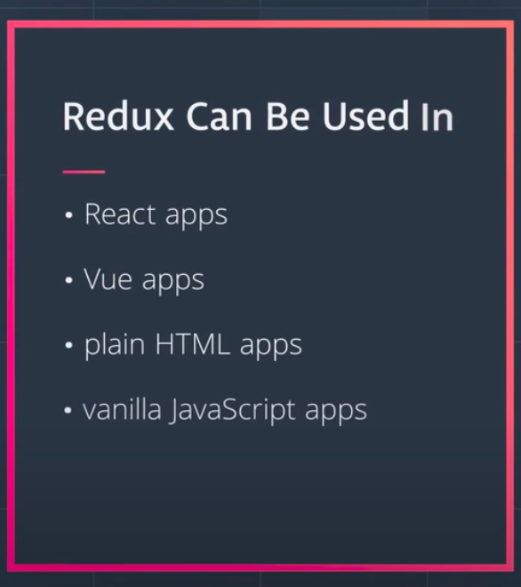

# REDUX

Main goal of Redux are:

- to make the state management of an application more predictable by moving it to a centralized location and establising the strict rules for getting, listening and updating that state.


In these images, the app appears exactly the same to the end user, however, it's functioning quite differently under the hood. All of the data is stored outside of the UI code and is just referenced from the UI code.

With a change like this, if the data needs to be modified at all, then all of the data is located in one place and needs to be only changed once. Then the areas of the app that are referencing pieces of data, will be updated since the source they're pulling from has changed.

State Tree
One of the key points of Redux is that all of the data is stored in a single object called the state tree. But what does a state tree actually look like? Here's an example:

```js

  {
    recipes: [
      { … },
      { … },
      { … }
    ],
    ingredients: [
      { … },
      { … },
      { … },
      { … },
      { … },
      { … }
    ],
    products: [
      { … },
      { … },
      { … },
      { … }
    ]
  }

```

- Each of the object is handled by its own **Reducer** and finally all are combined together to form a _rootReducer_ which forms our state/statetree.

- See how all of the data for this imaginary cooking site is stored in a single object? So all of the state (or "application data") for this site is stored in one, single location. This is what we mean when we say "state tree"...it's just all of the data stored in a single object.

- We saw that in traditional apps, the data is mixed in with the UI and markup. This can lead to hard-to-find bugs where updating the state in one location doesn't update it in every location.

- We learned that the main goal that Redux is trying to offer is **predictable State management**. The way that Redux tries to accomplish this is through having a single state tree. This state tree is an object that stores the entire state for an application. Now that all state is stored in one location.

### We discovered three ways to interact with it:

> 1. getting the state - getStore()

> 2. listening for changes to the state - subscribe(listener)

> 3. updating the state - dispatch(action) using Actions, Action Creator and Reducer.

Then we combine the three items above and the state tree object itself into one unit which we called the store.


```js
function createStore() {
  // The store should have four parts
  // 1. The state
  // 2. Get the state.
  // 3. Listen to changes on the state.
  // 4. Update the state

  let state;
  let listeners = [];
  const getState = () => state;

  const subscribe = (listener) => {
    listeners.push(listener);
    // returns a unsubribed function.
    return () => {
      listeners = listeners.filter((l) => l !== listener);
    };
  };

  return {
    getState,
    subscribe,
  };
}

const store = new createStore();
store.subscribe(() => {
  console.log(":Listener 1", store.getState());
});

store.subscribe(() => {
  console.log(":Listener 2", store.getState());
});
```

- Updating the store state

  - we don't want everyone to update the state hence we have some guards hired out know as Action events.

    

  - When an event takes place in a Redux application, we use a plain JavaScript object to keep track of what the specific event was. This object is called an Action.

  ```js
  {
    type: "ADD_PRODUCT_TO_CART";
  }
  ```

  - As you can see, an Action is clearly just a plain JavaScript object. What makes this plain JavaScript object special in Redux, is that every Action must have a **type property**. The purpose of the type property is to let our app (Redux) know exactly what event just took place.

    Now, since an Action is just a regular object, we can include extra data about the event that took place:

    ```js
    {
      type: "ADD_PRODUCT_TO_CART",
      productId: 17
    }
    ```

    In this Action, we're including the productId field. Now we know exactly which product was added to the store!
    Action Creators are functions that create/return action objects. For example:

    ```js
    const addItem = (item) => ({
      type: ADD_ITEM,
      item,
    });
    ```

## Reducers

The function that returns the new state needs to be a pure function(why? because pure functions ensures output predictability).


- What are Pure Functions?

  - Return the same result if the same arguments are passed in.
  - Depend solely on the arguments passed into them
  - Do not produce side effects, such as API requests and I/O operations

- These pure functions that take in the state and action are known as **Reducers**.

```js
// Reducer
function todos(state = [], action) {
  if (action.type === "ADD_TODO") {
    return [...state, action.todo];
  }
  return state;
}

// Library Code
function createStore(reducer) {
  // The store should have four parts
  // 1. The state
  // 2. Get the state.
  // 3. Listen to changes on the state.
  // 4. Update the state

  let state;
  let listeners = [];

  const getState = () => state;

  const subscribe = (listener) => {
    listeners.push(listener);
    return () => {
      listeners = listeners.filter((l) => l !== listener);
    };
  };

  // updating the state
  const dispatch = (action) => {
    state = reducer(state, action);
    listeners.forEach((listener) => listener());
  };

  return {
    getState,
    subscribe,
    dispatch,
  };
}
```

- We've finally finished creating the createStore function! let's break down what we've accomplished:

  1. we created a function called createStore() that returns a store object
  2. createStore() must be passed a "reducer" function when invoked
  3. the store object has three methods on it:
     - .getState() - used to get the current state from the store
     - .subscribe() - used to provide a listener function the store will call when the state changes
     - .dispatch() - used to make changes to the store's state

```js
store.subscribe(() => {
  console.log("The new state is: ", store.getState());
});
// updating the state
store.dispatch({
  type: "ADD_TODO",
  todo: {
    id: 0,
    name: "Learn Redux",
    complete: false,
  },
});
```

```js
// more actions in a reducer
function todos(state = [], action) {
  switch (action.type) {
    case "ADD_TODO":
      return state.concat([action.todo]);
    case "REMOVE_TODO":
      return state.filter((todo) => todo.id !== action.id);
    case "TOGGLE_TODO":
      return state.map((todo) =>
        todo.id !== action.id
          ? todo
          : Object.assign({}, todo, { complete: !todo.complete })
      );
    default:
      return state;
  }
}

function goals(state = [], action) {
  switch (action.type) {
    case "ADD_GOAL":
      return state.concat([action.goal]);
    case "REMOVE_GOAL":
      return state.filter((goal) => goal.id !== action.id);
    default:
      return state;
  }
}
```

##### kind of pointed it out at the end of the previous screencast, but we now have two reducer functions:

- todos
- goals
- However, the createStore() function we built can only handle a single reducer function:

```js
// createStore takes one reducer function as an argument
const store = createStore(todos);
// We can't call createStore() passing it two reducer functions:

// this will not work
const store = createStore(todos, goals);

// so we combine these reducers into a large reducer know as root Reducer.
function rootReducer(state = {}, action) {
  return {
    todos: todos(state.todos, action),
    goals: goals(state.goals, action),
  };
}

// and then
const store = createStore(rootReducer);
```

- Reducers must be pure
- Though each reducer handles a different slice of state, we must combine reducers into a single reducer to pass to the store
- createStore() takes only one reducer argument
- Reducers are typically named after the slices of state they manage

- Prefer constants rather than strings as the values of type properties.
  > Both work -- but when using constants, the console will throw an error rather than fail silently should there be any misspellings (e.g. LOAD_PROFIEL vs. LOAD_PROFILE)

## Middleware


- You’ve learned how Redux makes state management more predictable: in order to change the store’s state, an action describing that change must be dispatched to the reducer. In turn, the reducer produces the new state. This new state replaces the previous state in the store. So the next time store.getState() is called, the new, most up-to-date state is returned.

- Between the dispatching of an action and the reducer running, we can introduce code called middleware to intercept the action before the reducer is invoked. The Redux docs describe middleware as:

  > …a third-party extension point between dispatching an action, and the moment it reaches the reducer.

- What's great about middleware is that once it receives the action, it can carry out a number of operations, including:

  - producing a side effect (e.g., logging information about the store)
  - processing the action itself (e.g., making an asynchronous HTTP request)
  - redirecting the action (e.g., to another piece of middleware)
  - dispatching supplementary actions
  - or even some combination of the above! Middleware can do any of these before passing the action along to the reducer.

  > Middleware is the suggested way to extend Redux with custom functionality.

```js
const store = Redux.createStore(rootReducer, Redux.applyMiddleware(checker));
```

---

## Redux in Apps

- **Redux can be used with Vanlla js, Vue, React**



## Async Redux and Redux Thunk

- If a web application requires interaction with a server, applying middleware such as thunk helps solve the issue of asynchronous data flow. Thunk middleware allows us to write action creators that return functions rather than objects.

- By calling our API in an action creator, we make the action creator responsible for fetching the data it needs to create the action. Since we move the data-fetching code to action creators, we build a cleaner separation between our UI logic and our data-fetching logic. As a result, thunks can then be used to delay an action dispatch, or to dispatch only if a certain condition is met (e.g., a request is resolved).

## Optimistic Updates

- When dealing with asynchronous requests, there will always be some delay involved. If not taken into consideration, this could cause some weird UI issues. For example, let’s say when a user wants to delete a todo item, that whole process from when the user clicks“delete” to when that item is removed from the database takes two seconds. If you designed the UI to wait for the confirmation from the server to remove the item from the list on the client, your user would click “delete” and then would have to wait for two seconds to see that update in the UI. That’s not the best experience.

- Instead what you can do is a technique called optimistic updates. Instead of waiting for confirmation from the server, just instantly remove the user from the UI when the user clicks “delete”, then, if the server responds back with an error that the user wasn’t actually deleted, you can add the information back in. This way your user gets that instant feedback from the UI, but, under the hood, the request is still asynchronous.

### Redux Rules/ 3 principles:

1. Single source of truth. The global state of your application is stored in an object tree within a single store.
2. State is read-only. The only way to change the state is to emit an action, an object describing what happened.
   - Only an Action event can change the state of the store.
3. Changes are made with pure functions.
   - The function that returns the new state needs to be a pure function(Reducer).

## Context API

- Context provides a way to pass data through the component tree without having to pass props down manually at every level.

efore we add the Context API into our app, let's make sure we're on the same page as to how it all works.

Recall that in one of the previous screencasts, passing data from one component to another component was a bit cumbersome. We had to pass data from component to component:

```js
import React from "react";
import { render } from "react-dom";

function Parent({ name }) {
  return (
    <div>
      <h1>Parent</h1>
      <Child name={name} />
    </div>
  );
}

function Child({ name }) {
  return (
    <div>
      <h1>Child</h1>
      <Grandchild name={name} />
    </div>
  );
}

function Grandchild({ name }) {
  return (
    <div>
      <h1>Grandchild</h1>
      <h3>Name: {name}</h3>
    </div>
  );
}

class App extends React.Component {
  render() {
    const name = "Tyler";

    return <Parent />;
  }
}

render(<App />, document.getElementById("root"));
```

The App component renders Parent, which renders Child, which renders Grandchild. However, what's important to notice here is that the Grandchild component wants to render name -- but the data for name lives inside the App component.

Because Grandchild is so deeply nested, we have to pass the name prop one-by-one from App through all the components until it reaches Grandchild. What's more: we must do this even if any of the components along the way (Parent and Child) aren't even concerned with the name data!

This process of "threading props" to send data to a child component can be tiresome, and perhaps even error-prone. Luckily, we can avoid it with React's Context API. To begin, we'll use React's createContext() function to return an object with a Provider as well as a Consumer.

```js
const Context = React.createContext();
```

## Context.Provider

The Provider component is used in the upper level of the component tree; that is, the component from which the data to be passed is held. In our case, this was the App component. We passed the name data as the value of Provider's value prop:

```js
class App extends React.Component {
  render() {
    const name = "Tyler";

    return (
      <Context.Provider value={name}>
        <Parent />
      </Context.Provider>
    );
  }
}
```

Note that the Provider component simply wraps around the entire component to be rendered!

## Context.Consumer

On the receiving end (i.e., a component "under" the Provider in the component hierarchy), we use the Consumer component. In our example, we passed Consumer a function as a child. This function accepts a value and returns some JSX:

```js
function Grandchild({ name }) {
  return (
    <Context.Consumer>
      {(name) => (
        <div>
          <h1>Grandchild</h1>
          <h3>Name: {name}</h3>
        </div>
      )}
    </Context.Consumer>
  );
}
```

As a result, we were able to render the Grandchild component with the correct name data without ever having to pass that data down the entire component thread! That's a lot less code than the previous way we had to do it. So React's Context API provides a terse, approachable way to easily communicate information from one component to another.

Now, let's go ahead and utilize Context in our todos app.

**Connected component as well as Container Component**

- These are different names that really mean the same thing - a component that is connected to the store. This is in contrast to a component that is just responsible for rendering UI content. We call these "Presentation Components". There are other names for a "Presentational Component", too.

The point of these names are to help explain what the purpose of the component is for:

A connected component is connected to the Redux store and is responsible for getting data from the store.
A presentational component should not access the store. It should receive any information it needs as props and then just render a UI.

## The react-redux Bindings

Let's take a moment to recap the changes we've made to our app in this Lesson, because we've updated quite a bit!

Previously, we leveraged the standard redux library to build our app. This allowed us to create a Redux store with the createStore() function, giving us an API to listen (subscribe()), get updates (getState()), and make updates (dispatch()) to state. We then created our own Provider component to efficiently pass the store to components that needed it, as well as our own connect() function so that our components can access "slices" of state as props.

We can build a fully-functional React and Redux app without Provider or connect(), but since they greatly simplify how React components interact with the Redux store, the creators of redux have included them in the react-redux package!

## Provider

With react-redux, rather than creating and using our own Provider which looks like this:

```js
const Context = React.createContext();

class Provider extends React.Component {
  render() {
    return (
      <Context.Provider value={this.props.store}>
        {this.props.children}
      </Context.Provider>
    );
  }
}

ReactDOM.render(
  <Provider store={store}>
    <ConnectedApp />
  </Provider>,
  document.getElementById("app")
);
```

...we can simply use the Provider component defined by the react-redux package! This allows us to wrap our entire app with Provider, effectively passing the store to even the most deeply nested components.

```js
ReactDOM.render(
  <ReactRedux.Provider store={store}>
    <ConnectedApp />
  </ReactRedux.Provider>,
  document.getElementById("app")
);
connect();
```

Similarly, we can also leverage react-redux's connect() function right out of the box. connect() is a higher-order function that takes in two arguments (as well as a few optional arguments) and returns a function. Check out its signature below:

```js
const buildConnectedComponent = connect(mapStateToProps, mapDispatchToProps);
```

What's vital to understand is that buildConnectedComponent is a function. buildConnectedComponent will take a regular (presentational) React component and return a new, "connected" component.

```js
const ConnectedComponent = buildConnectedComponent(MyComponent);
```

ConnectedComponent renders MyComponent, passing it the props as defined by mapStateToProps and mapDispatchToPros.

We can avoid having the intermediary buildConnectedComponent variable and just call the functions back-to-back:

```js
const ConnectedComponent = connect(
  mapStateToProps,
  mapDispatchToProps
)(MyComponent);
```
